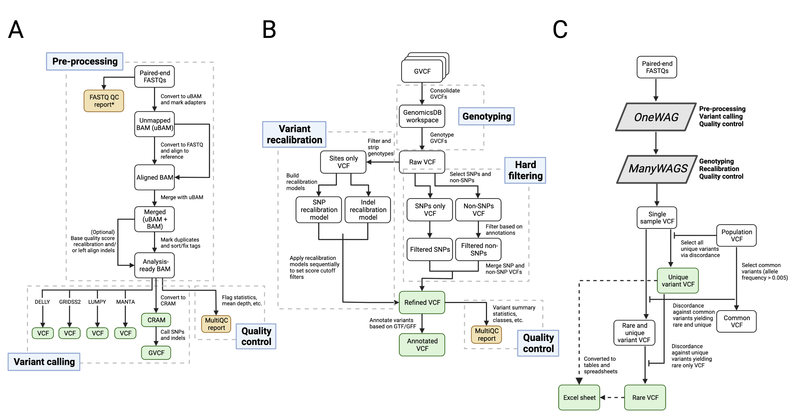

# WAGS

WAGS consists of three pipelines, adapted from GATK's Best Practices. The first pipeline processes raw FASTQs into genomic variant call format (GVCF) files and is capable of processing samples split across flow cells or lanes (**A**). The second pipeline takes multiple GVCFs as inputs and performs joint genotype calling and variant annotation (**B**). And the third pipeline compares variants in a specific sample to variants in a larger population variant call file (VCF) to enable the identification of unique variants in a particular animal (**C**).

<p align="center">
  
</p>

## Dependencies

- [Python](https://www.python.org/)
- [Mamba](https://github.com/mamba-org/mamba) or [Conda](https://conda.io/)
- [Snakemake](https://snakemake.readthedocs.io/)
- [Snakemake-Profiles](https://github.com/Snakemake-Profiles)
- Miscellaneous python modules [pyaml](https://pyyaml.org/) and [xlsxwriter](https://xlsxwriter.readthedocs.io/)
- [Apptainer/Singularity](https://apptainer.org/)
- [MinIO Client](https://min.io/docs/minio/linux/reference/minio-mc.html)

## Initial setup

**1. Install dependencies**

If you do not have `conda` already installed, the Snakemake developers **recommend** to install via [Mambaforge](https://github.com/conda-forge/miniforge#mambaforge).

**NOTE:** *In January of 2024, Snakamake underwent a major update to version 8 which introduced a number of WAGS-breaking changes. Until these are addressed, we suggest using version 7 which can be specified using version number as below.*

```
# download Mambaforge installer (assuming Unix-like platform)
wget "https://github.com/conda-forge/miniforge/releases/latest/download/Mambaforge-$(uname)-$(uname -m).sh"
bash Mambaforge-$(uname)-$(uname -m).sh

# updata Mamba
mamba update mamba -c conda-forge

# create a Snakemake environment which includes all Snakemake dependencies in
# addition to the miscellaneous modules above
mamba create \
    -c conda-forge -c bioconda \
    -n snakemake \ # name of the environment
    snakemake=7.19 pyaml xlsxwriter
```

Alternatively, if you are already familiar with `conda` and creating environments, it is suggested to install `mamba` in your base environment and use that to build your environment.

```
# install mamba
conda install -n base -c conda-forge mamba

# create a Snakemake environment
mamba create \
    -c conda-forge -c bioconda \
    -n snakemake \ # name of the environment
    snakemake pyaml wget xlsxwriter
```

**2. Download the container**

Due to the size of the included reference genomes and index files (and depending on your internet speed) this should take ~5 minutes.

```
wget https://s3.msi.umn.edu/wags/wags.sif
```

**3. Clone this repo**

```
git clone git@github.com:jonahcullen/wags.git
```

**4. Install and setup MinIO client (optional)**

If desired, `wags` can work with MinIO Client (`mc`) to save pipeline outputs (e.g. FASTQ, BAM, GVCF), job-runner logs, and individual processing logs. See MinIO Client install instructions [here](https://min.io/docs/minio/linux/reference/minio-mc.html#quickstart). Note: before submitting a job run to your HPC scheduler, you will need to export your credentials as

```
export AWS_ACCESS_KEY=...
export AWS_SECRET_KEY=...
```

## Reference genome

The WAGS container currently includes a handful of reference genomes making the processing of FASTQs and joint genotyping _ready-to-go_ with those references. Available references can listed with `singularity exec PATH/TO/wags.sif tree /home/refgen/ -L 2`

```
/home/refgen/
├── cat
│   └── Fca126_mat1.0
├── dog
│   ├── UU_Cfam_GSD_1.0_ROSY
│   ├── canfam3
│   └── canfam4
├── horse
│   └── goldenPath
└── tiger
    └── tiger
```

For all other reference genomes, the required accessory and index files may be generated using the `prep_custom_ref.py` module starting from only a FASTA. Similar to the other pipelines, `prep_custom_ref.py` prepares a complete set of pipeline inputs to be submitted to the HPC scheduler (`python wags/prep_custom_ref.py --help`)

```
required arguments:
  -r, --ref         reference name (e.g. equcab3, canfam4)
  -n, --species     species name (e.g. horse, dog)
  -f, --fasta       path to reference fasta
  -s, --snake-env   conda environment with snakemake
  -p, --partition   default partition(s) to use (e.g. 'par1' or 'par1,par2'
  -e, --email       email address for job logs
  -a, --account     default scheduler account

optional arguments:
  -o , --out            path to custom reference out dir [default: ~/.wags]
  --sites SITES         comma-separated file containing names (col 1) and
                        paths to resource VCFs (and indices) (col 2) to be 
                        used with --ref custom and --bqsr
  --nrun-length NRUN_LENGTH
                        maximum number of contiguous missing
                        bases to tolerate for generating intervals
                        [default: 50]
  --scatter-size SCATTER_SIZE
                        maximum number of intervals across which
                        to haplotype calling and bqsr (if desired)
                        [default: 50]
  --profile PROFILE     HPC job scheduler [default: slurm]
  --sif SIF             location of container image [default: ~/.sif/wags.sif]
  -h, --help            show this help message and exit
```

As an example, to prepare the reference inputs for the platypus (Ornithorhynchus anatinus), obtain the genome sequence

```
wget https://ftp.ensembl.org/pub/release-109/fasta/ornithorhynchus_anatinus/dna/Ornithorhynchus_anatinus.mOrnAna1.p.v1.dna.toplevel.fa.gz
```

and run `prep_custom_ref.py` as 

```
python ../rescuer/wags/prep_custom_ref.py \
    --ref mOrnAna1.p.v1 \
    --species platypus \
    --fasta Ornithorhynchus_anatinus.mOrnAna1.p.v1.dna.toplevel.fa.gz \
    --snake-env SNAKEMAKE_ENV \
    --partition PAR1,PAR2 \
    --email cull0084@mesabi.msi.umn.edu \
    --account HPC_ACCOUNT \
    --out ~/.wags/
```

which returns `submit platypus_mOrnAna1.p.v1.prep_wags.slurm from /home/fried255/cull0084/.wags/platypus/mOrnAna1.p.v1 to prep mOrnAna1.p.v1 for wags`. Following the successful run of `platypus_mOrnAna1.p.v1.prep_wags.slurm`, the required genome and alignment indices will be available along with `mOrnAna1.p.v1_config.yaml`, the input config for running platypus samples with *OneWAG*.

## FASTQ to GVCF (OneWAG)

**Prepare pipeline submissions**

The executable `prep_subs.py` is responsible for generating all required pipeline inputs to be submitted to the cluster scheduler. The required input is a CSV file containing sample name, breed, sex (if known), and the associated FASTQ file prefix. The prefix should be the portion of the paired FASTQ name that distinguishes a given sample across multiple paired FASTQs (e.g. a sample split across multiple lanes). For example, if the input CSV was

```
dogid,breed,gender,fastq_id
SampleA,poodle,M,SampleA_2022
```

with FASTQs located in `/path/to/raw/data/`

```
SampleA_2022_L001_R1.fastq.gz
SampleA_2022_L001_R2.fastq.gz
SampleA_2022_L002_R1.fastq.gz
SampleA_2022_L002_R2.fastq.gz
SampleA_2000_L001_R1.fastq.gz
SampleA_2000_L001_R2.fastq.gz
```

`SampleA` would be matched with the two sets of paired FASTQs, one from lane L001 `SampleA_2022_L001_R1.fastq.gz/SampleA_2022_L001_R2.fastq.gz` and the other from L002 `SampleA_2022_L002_R1.fastq.gz/SampleA_2022_L002_R2.fastq.gz`. If however, `SampleA` should also have included the pair `SampleA_2000_L001_R1.fastq.gz/SampleA_2000_L001_R2.fastq.gz`, the input CSV should be modified as

```
dogid,breed,gender,fastq_id
SampleA,poodle,M,SampleA_20
```

The input CSV may contain as many samples as desired where `prep_subs.py` will generate pipeline inputs for each included sample. A minimal example of running `prep_subs.py` for processing using S3 storage is below (for all required and optional arguments `prep_subs.py --help`)

```
python ./wags/prep_subs.py \
    --meta input.csv \
    --fastqs PATH/TO/FASTQ_DIR \ 
    --ref REF_GENOME \          
    --out PATH/TO/OUTDIR/ \                    
    --bucket RESULTS \                   
    --snake-env SNAKEMAKE_ENV \
    --partition PAR1,PAR2 \
    --email USER@email.com \
    --account HPC_ACCOUNT \
    --remote S3 \
    --alias MINIO_ALIAS
```

Note that `--bucket` here is the name of the per-sample output directory nested within `--out` and must be an available S3 bucket if using `--remote S3`. It should also be noted the importance of two additional options `run-length` and `scatter-size`. `run-length` determines the maximum number of missing bases allowed to define interval boundaries, while `scatter-size` determines the number of intervals that can be processed simultaneously, both of which have default values of 50. Together these options have an impact on processing speed for haplotype calling and BQSR (if desired). This will generate the following directory structure

```
PATH/TO/OUTDIR/
    poodle/
        SampleA/
            REF_GENOME/
                input.tsv
                REF_GENOME_config.yaml
                poodle_SampleA.one_wags.slurm
                one_wags.smk
                rules/
                slurm_logs/
                slurm.go_wags/
                src/
```

Each pipeline can then be initiated with `sbatch poodle_SampleA.one_wags.slurm`. NOTE: Slurm is the default scheduler (`--profile`). Other schedulers may be setup using the instructions provided by [Snakemake-Profiles](https://github.com/Snakemake-Profiles). Feel free to open an issue if assistance is needed!

## GVCFs to VCF (ManyWAGS)

**Prepare joint calling inputs**

To prepare for the joint genoptying pipeline, a tab-separated file mapping sample IDs to GVCFs (as generated above) is required as shown below

```
SampleA /path/to/SampleA.g.vcf.gz
SampleB /path/to/SampleB.g.vcf.gz
SampleC /path/to/SampleC.g.vcf.gz
```

Next, `config_joint.py` is used to prepare the configuration file. If the species and reference of interest is already within the container (e.g. dog - canfam4), `--fasta`, `--fasta_dict`, and `--gtf` do not need to be set as optional arguments. An example of preparing the configuration file for canfam4 is shown below (see `python config_joint.py --help` for all available arugments)

```
python ./wags/config_joint.py \
    --ref canfam4 \
    --bucket RESULTS
```

To setup the pipeline inputs, `prep_joint.py` has the following options

```
required arguments:
  -c, --config      path to config file generated by config_joint.py
  -g, --gvcfs       path to file with mapping of sample name to
                        gvcf in tab delimited format with no header
  -s, --snake-env   conda environment with snakemake
  -p, --partition   default partition(s) to use (e.g. 'par1' or 'par1,par2'
  -e, --email       email address for job logs
  -a, --account     default scheduler account
  -o, --out         path to out dir

optional arguments:
  --vqsr-snps           recalibrate snps with known sites.
                        if false, hard filtering will be applied
                        to all snps [default: false]
  --vqsr-indels         recalibrate indels with known sites.
                        if false, hard filtering will be applied
                        to all non-snps [default: false]
  --anchor-type ANCHOR_TYPE
                        anchor type for generating intervals.
                        'intergenic' requires an annotation file
                        (e.g. gff/gtf) to be included during
                        config_joint.py setup [options: nruns, intergenic]
  --nrun-length NRUN_LENGTH
                        maximum number of contiguous missing
                        bases to tolerate. only relevant for
                        anchor-type nruns
                        allowed [default: 50]
  --interval-length INTERVAL_LENGTH
                        desired invterval target lengths.
                        this does not guarantee a uniform
                        length and is largely dependent on
                        interval design choice (--anchor-type)
                        and genome completeness [default: 10000000]
  --profile PROFILE     HPC job scheduler [default: slurm]
  --remote REMOTE       save outputs to remote: S3, SFTP [default: local]
  --sif SIF             path to singularity image file [default: ~/.sif/wags.sif]
  -h, --help            show this help message and exit
```

where `--config` is the configuration file generated by `config_joint.py` and `--gvcfs` is the tab-separated mapping file outlined above. `anchor-type` can be used to swtich between two methods for generating interval endpoints: 1) *nruns* defines endpoints by runs of missing bases (set via `--nrun-length`) or 2) *intergenic* where endpoints are set by the midpoints of intergenic regions as indicated in the reference annotation (i.e. this mode requires the reference genome have an annotation in the form of a GTF or GFF). Regardless of the interval boundary method, the resulting intervals are collapsed into larger intervals of an ideal maximum length (default 10 million). This value can be modified with `--interval-length`.

NOTE that the default "hard filtering" of SNPs and indels requires no additional inputs. If recalibration is desired, known sites for the dog (canfam3, canfam4, and UU_Cfam_GSD_1.0_ROSY) and horse (equcab3) are directly accessible from the container. We are currently working toward making the usage of custom sites available across any species.

## Private variants - GVCF to VCF (OnlyWAGS)

Following joint genotpying via *ManyWAGS*, samples not included may be compared against the population VCF to identify variants that are unique or rare. The setup is the same as *OneWAG* with inclusion of the `--money` flag. Additionally, `--pop-vcf` is required (path to the population VCF) and the allele frequency defining common variants may be adjusted using `--allele-freq` (default 0.005).

